# Distrubuted Shared WhiteBoard

## Introduction
A Java based desktop application that allows multiple users to draw shapes and chat at the same time.

## Features

* Front-end: JavaFX
* Back-end: Java
* Communication protocol: 
  * Java RMI: all communication between whiteboard server and data server, clients send request to whiteboard server.
  * MQTT: whiteboard server publish updates to all subscribed clients.
* Access control: manager has all the rights to create/delete/close a whiteboard session, as well as save shaps and import files. Manager also has the right to manage the access of visitors.
* User need to log in/sign up to join a whiteboard session, all passwords are encrypted using SHA512 algorithm.
* Multiple whiteboards coule be created, and user is able to choose whatever whiteboard to join.

## Usage

> Prerequisite: JDK 8 installed.

### Step 1
`git clone https://github.com/ZhangzihanGit/Distributed-Shared-Whiteboard-Application.git`

### Step 2
`cd Distributed-Shared-Whiteboard-Application/runnable-jar`

### Step 3
Run the data server:

`java -jar dataServer.jar -ip <network_ipv4_address> -p <port_number>`

Example:

`java -jar dataServer.jar -ip localhost -p 1111`

### Step 4:
Run the whiteboard server:

`java -jar wbServer.jar -ip <network_ipv4_address>`

Example:

`java -jar wbServer.jar -ip localhost`

### Step 5:
Run the client application:

`java -jar client.jar`

## Demo

### Whiteboard Server GUI

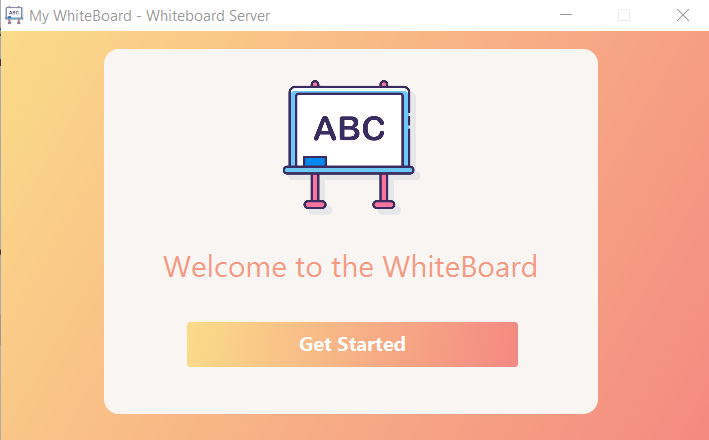

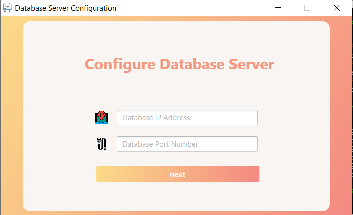

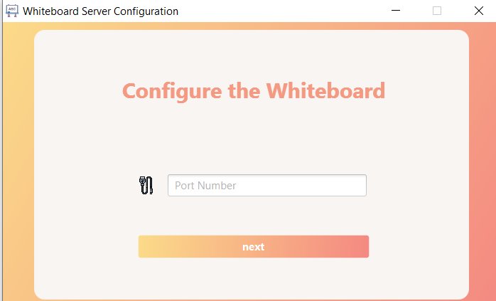

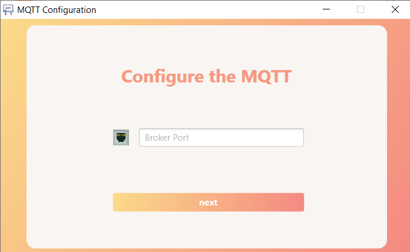

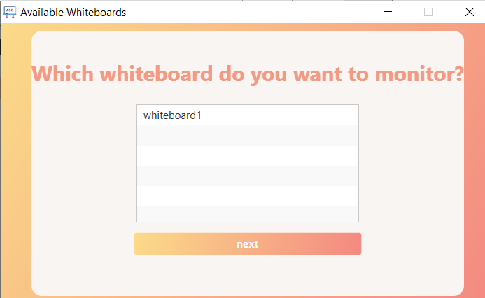

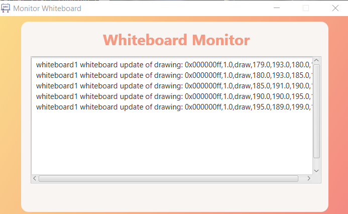

### Client GUI
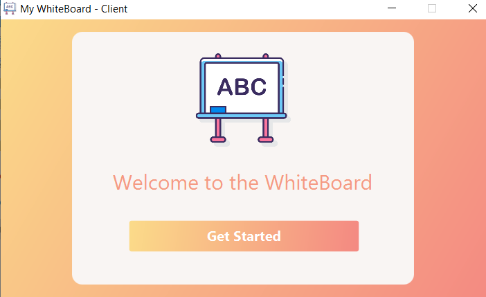

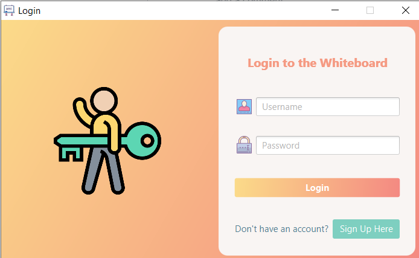

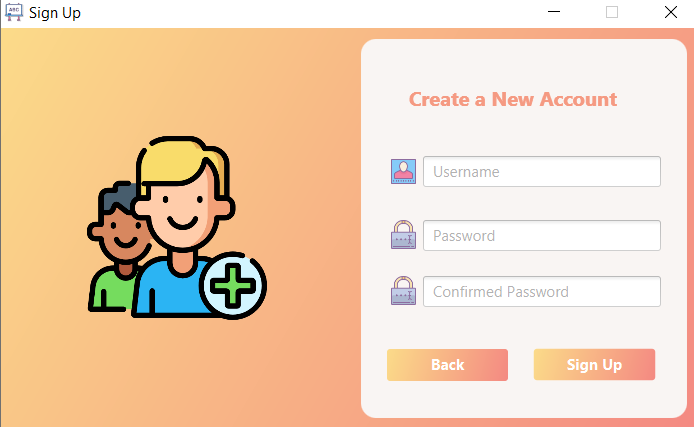

User can choose a role.

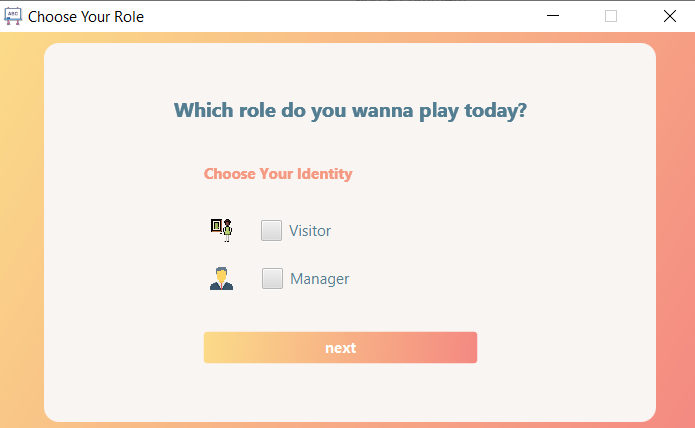

A manager has the right the create a new whiteboard.

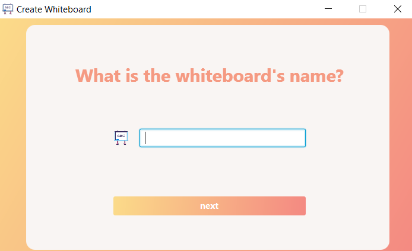

A user can choose to join any whiteboard, if any.

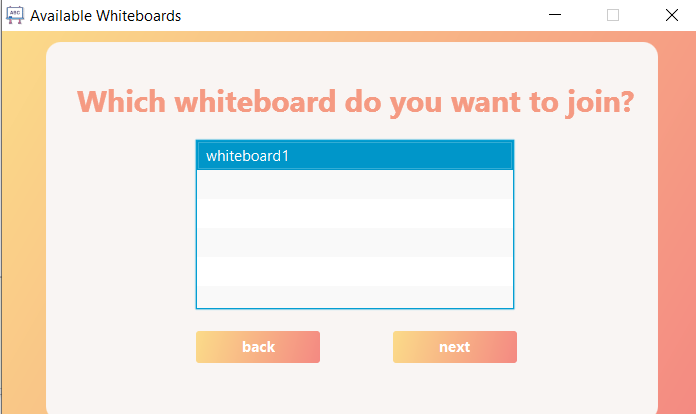

A user must be approved by the manager to join.

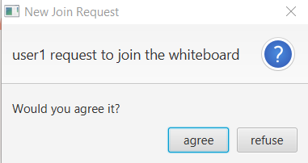

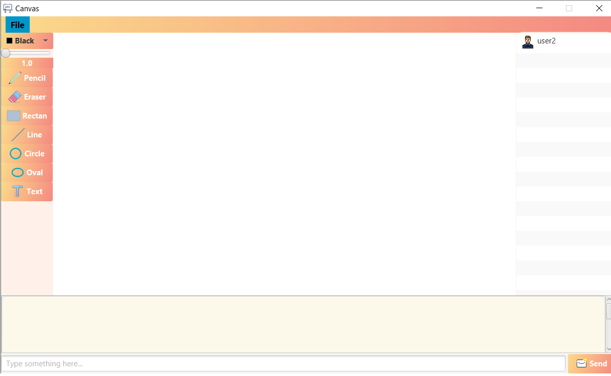

## Contributors
Very thankful to my brilliant teammates:

- [Xiuge Chen](https://github.com/XiugeChen)
- [Chengeng Liu](https://github.com/chengengliu)
- [Guang Yang](https://github.com/yourDanmise)
