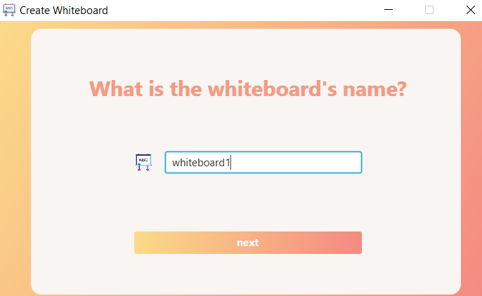

# Distrubuted Shared WhiteBoard

## Introduction
Java based desktop application that 

## Features

## Usage

> Prerequisite: JDK 8 installed.

### Step 1
`git clone https://github.com/ZhangzihanGit/Distributed-Shared-Whiteboard-Application.git`

### Step 2
`cd Distributed-Shared-Whiteboard-Application/runnable-jar`

### Step 3
Run the data server:

`java -jar dataServer.jar -ip <network_ipv4_address> -p <port_number>`

Example:

`java -jar dataServer.jar -ip localhost -p 1111`

### Step 4:
Run the whiteboard server:

`java -jar wbServer.jar -ip <network_ipv4_address>`

Example:

`java -jar wbServer.jar -ip localhost`

### Step 5:
Run the client application:

`java -jar client.jar`

## Demo

### Whiteboard Server GUI

 
 

### Client GUI

 

User can choose a role.

A manager has the right the create a new whiteboard.

A user can choose to join any whiteboard, if any.

A user must be approved by the manager to join.

## Contributors
Very thankful to my brilliant teammates:

- [Xiuge Chen](https://github.com/XiugeChen)
- [Chengeng Liu](https://github.com/chengengliu)
- [Guang Yang](https://github.com/yourDanmise)
